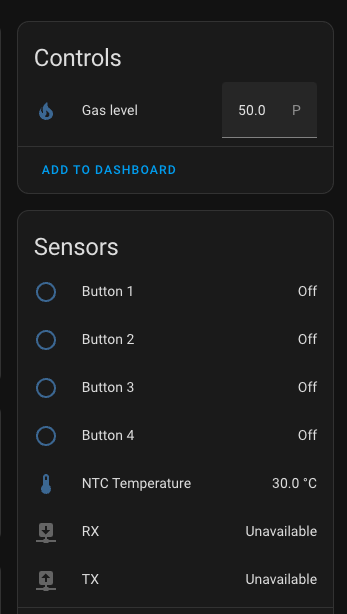

## Gas Water Heater Temperature Control with Servo and ESPHome

**Description:**

This project addresses the challenges of fluctuating hot water temperature in a home with two bathrooms and a distance-dependent gas water heater. By integrating a servo motor with ESPHome, the gas level can be adjusted remotely from each bathroom, ensuring a consistent and comfortable showering experience.

**Motivation:**

The existing gas water heater lacked automatic temperature control, requiring manual adjustments before each shower. This was inconvenient and ineffective due to factors like:

* **Distance-dependent flow:** Different water flow rates in each bathroom affected the final temperature.
* **Cold water temperature changes:** Seasonal variations in cold water temperature impacted the final hot water output.
* **Manual adjustment challenges:** Finding the ideal gas level was difficult and time-consuming.

**Solution:**

This project employs an ESPHome-controlled servo motor connected to the gas water heater's gas valve. The servo's position corresponds to the desired gas level, translating to adjustable hot water temperature.

**Hardware:**

1. Gas water heater\
 
2. Servo motor: 15kg+ torque, 100°+ rotation minimum.\
  
1. NodeMCU ESP8266: [Arduino store](https://store.arduino.cc/products/nodemcu-esp8266).\
  

**Optional:**
  1. 9-12V Power supply adapter. (Only if you have the breadboard and you would like to power your heater with it, get rid of batteries)
  2. Nodemcu breadboard.\
  
  1. Toggle switch with center-off position.\
  
  1. LED indicator lights.\
   

**Requirements:**

1. Running HomeAssistant instance.
2. Esphome installed on HomeAssistant.
3. Basic knowledge of flashing Esp devices with Esphome.
4. Prepare the list of hardware described above.

**Steps to build:**

1. Connect the hardware
   1. Connect the servo to the right GPIO as shown in the diagram below.
   2. You can choose to connect the thermistor of the machine as well.
   3. if you decided to add the physical buttons please connect them according to the diagram as well.

2. Flash your NodeMcu with provided code `servo-controler.yaml`.

You should be able to see the following in Esphome integration if you decided to include all the buttons, lights servo and thermistor.

**Usage:**

1. Access the Homeassistant dashboard.
2. From the esphome integration visit this project.
3. Change the servo position, the servo should move.
4. Clicking any button should move the servo and blink the lights.

**Mounting the device:**
 Mount the servo to the gas pedal.\
    \
2. Mount the NodeMcu. You can see below how I have a cate6 cable, this connects all my buttons and leds. The yellow and white cables power up the heater. Red and Green cables for the thermistor.\
   